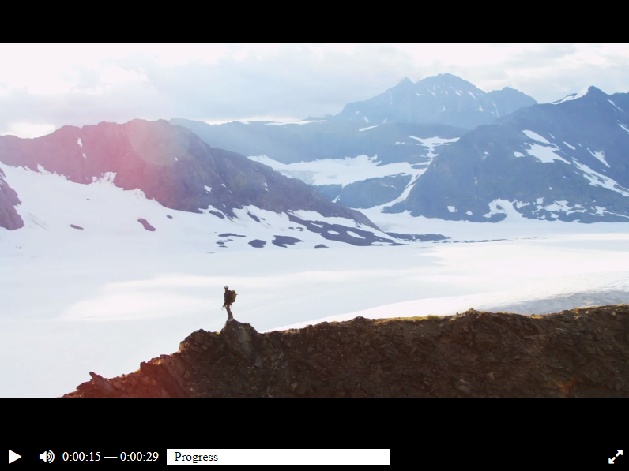

# Videoplayer's layout

You can see layout of videoplayer by [link](https://mokkofm.github.io/videoplayer-layout/). 



### How to use layout

* Dowload the code
* Check that you have Python 3  
* Install requirements:  
```
pip install -r requirements.txt
```
* How to see changing in layout in live-mode:
```
python main.py
```
You can change some elements of layout and look a result [here](http://127.0.0.1:5500/)

### Purpose

Code was written for learning purpose as a part of course for web-developers [dvmn.org](https://dvmn.org/).
